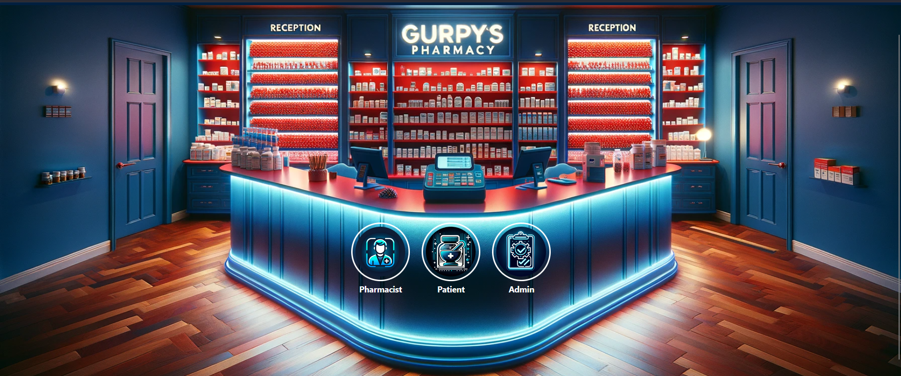
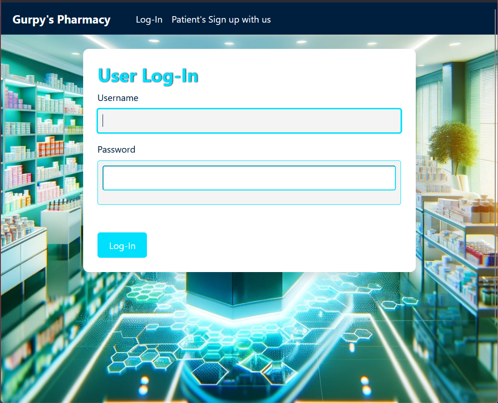
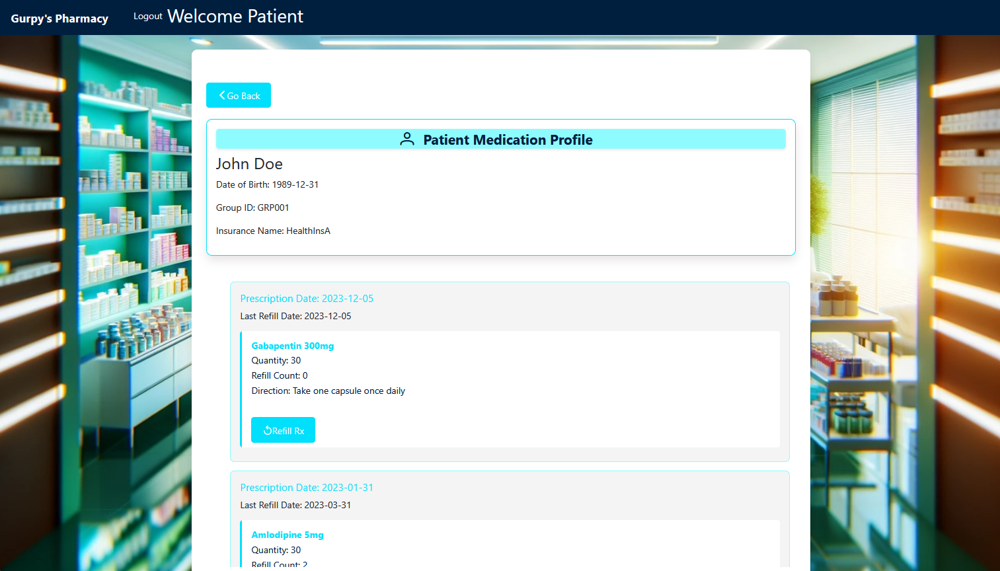
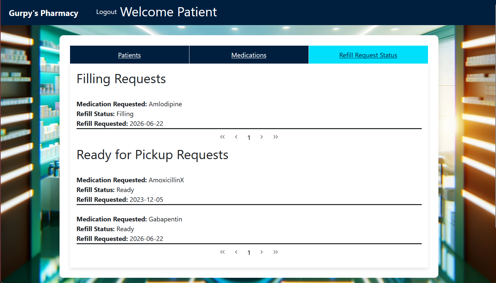
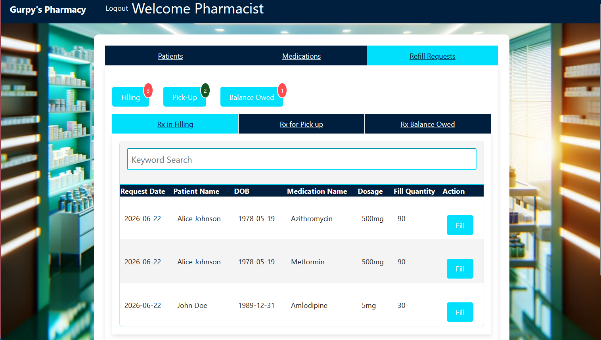
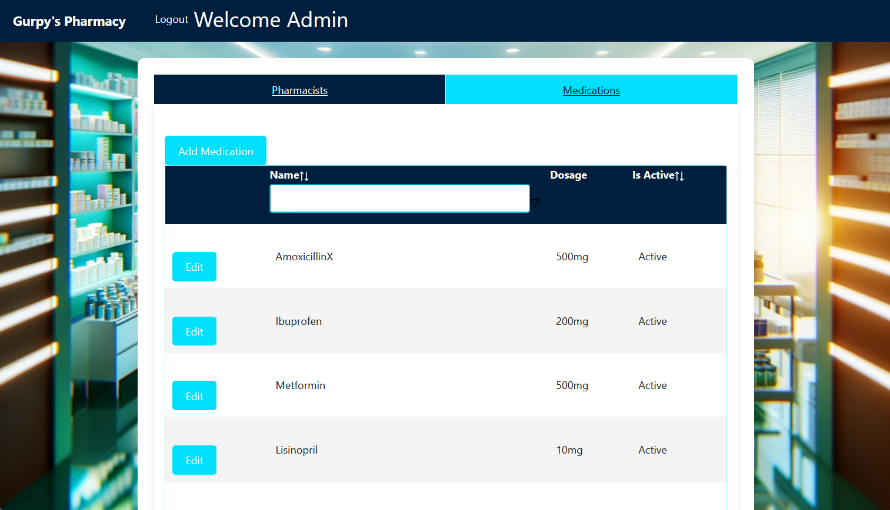

# Pharmacy Management System

A full-stack web app for running a pharmacy's daily operations. It has three kinds of users: patients, pharmacists, and administrators. Patients manage their profile, look up their medication history, and request refills. Pharmacists work the refill queue and keep inventory up to date. Administrators manage pharmacist accounts and the medication catalogue.

I built this as a full MERN-style project to get hands-on with role-based auth, a REST API, and a component-driven React UI.

## Screenshots








## At a glance
|                   |                                                                                       |
|-------------------|---------------------------------------------------------------------------------------|
| Client routes     | 7                                                                                     |
| React components  | ~22 (route pages plus reusable panels and form panes)                                 |
| REST endpoints    | 22 (19 core + 3 admin)                                                                |
| Mongoose schemas  | 7 (User, Patient, Pharmacist, Medication, PatientRecord, RefillRequest, Notification) |
| User roles        | 3 (Patient, Pharmacist, Admin)                                                        |

## Tech stack

**Frontend**
- React 18 with React Router v6
- PrimeReact 10 (DataTable, TabView, Dialog, DataScroller, Toast, OrderList, AutoComplete)
- React-Bootstrap and Bootstrap 5 for layout
- date-fns for date formatting

**Backend**
- Node.js with Express 4
- MongoDB through Mongoose 8
- bcryptjs for password hashing
- jsonwebtoken for stateless auth
- passport / passport-local for the login strategy
- dotenv for config

## Architecture

```
┌─────────────────┐          ┌──────────────────┐         ┌───────────────┐
│  React Client   │   HTTP   │  Express API     │ Mongoose│  MongoDB      │
│  (port 3000)    │  ──────► │  (port 3001)     │ ──────► │  pharmacy db  │
│  JWT in header  │   CORS   │  JWT verify      │         │               │
└─────────────────┘          └──────────────────┘         └───────────────┘
```

Login hands back a signed JWT (1 hour expiry). The client keeps it in `localStorage` and sends it as `Authorization: Bearer <token>` on every protected request. A middleware on the server verifies the token and attaches `req.userId` and `req.userType` so handlers know who's calling. On first connect, the server seeds mock users, patients, pharmacists, medications, and records if those collections are empty, so you get a working app without setting up data by hand.

## Principles and practices I followed

- **Role-based access in two layers.** Routes are protected on the server by JWT middleware, and mirrored on the client with a `ProtectedRoute` wrapper that takes an `allowedUserTypes` list. The client gate is for UX; the server gate is the one that actually enforces it.
- **One source of truth for the API URL.** The client reads its base URL from `config.js` instead of hardcoding `localhost` in every fetch, so pointing it at a different backend is a one-line change.
- **Idempotent seeding.** The seed loader only inserts mock data when a collection is empty, so restarting the server doesn't pile up duplicates.
- **Passwords are never stored in plain text.** bcryptjs hashes on registration and on admin-created accounts.
- **Composition over giant components.** The admin view is split into focused panes and form panes under `Administration/subcomponents/` rather than one big file.
- **Server-driven side effects.** Confirming a fill decrements medication stock and the patient's remaining refill count on the server, so the client can't get those numbers out of sync.

## Features by role

### Patient
- Self-register and log in
- Create and edit a profile (insurance, group ID, date of birth, contact)
- View medication history with prescription details
- Request a refill on any prescription that has refills left; duplicate requests are blocked
- See the live status of in-progress refill requests

### Pharmacist
- View all patients and add new ones (this also creates the underlying User account)
- Browse inventory with full-text search, sortable columns, and filter chips
- Work the refill queue across two tabs (Filling, then Ready for Pickup) with live badge counts
- Confirm a fill quantity, which decrements stock and the patient's refill count on the server
- Complete a pickup, which clears the request from the queue
- Add prescriptions to a patient's record

### Administrator
- Add or edit pharmacists; new accounts get a hashed default password from the environment
- Add or edit medications (name, dosage, price, stock, reorder threshold, prescription flag, active flag)

## Setup

### Prerequisites
- Node.js 18+ and npm
- MongoDB 7+ running locally

### 1. Configure environment variables

```bash
cp server/.env.example server/.env
cp client/gurpypharmacy/.env.example client/gurpypharmacy/.env
```

Set `JWT_SECRET` in `server/.env` to a long random string. The other defaults (port, MongoDB URI, CORS origin) are fine for local dev. The server won't start if `JWT_SECRET` is unset.

### 2. Install dependencies

```bash
cd server && npm install
cd ../client/gurpypharmacy && npm install
```

### 3. Start MongoDB

```bash
mongod
```

### 4. Start the backend

```bash
cd server && npm start
```

You should see `MongoDB Connected` and `Server is running on http://localhost:3001`. Mock data seeds on first startup.

### 5. Start the frontend

```bash
cd client/gurpypharmacy && npm start
```

The app opens at `http://localhost:3000`.

## Demo credentials

The quickest way in is to register a fresh patient with the "Patient's Sign up with us" link in the navbar, then log in.

To try the pharmacist and admin flows on a fresh database, create those accounts through the registration endpoint (the UI sign-up form only makes Patients):

```bash
curl -X POST http://localhost:3001/register \
  -H "Content-Type: application/json" \
  -d '{"username":"pharm@test.com","password":"yourpassword","userType":"Pharmacist"}'

curl -X POST http://localhost:3001/register \
  -H "Content-Type: application/json" \
  -d '{"username":"admin@test.com","password":"yourpassword","userType":"Admin"}'
```

Users created through the admin panel get the value of `DEFAULT_USER_PASSWORD` from `.env`.

## Project structure

```
PharmacyProject/
├── client/gurpypharmacy/        # React frontend (Create React App)
│   ├── src/
│   │   ├── App.js               # Router and top-level auth state
│   │   ├── config.js            # API base URL, read everywhere else
│   │   ├── pages/               # Route pages and reusable panels
│   │   │   ├── Administration/  # Admin tabbed view and its subcomponents
│   │   │   └── ...
│   │   └── images/
│   └── .env.example
└── server/
    ├── server.js                # Express app and most route handlers
    ├── server_subcomponents/
    │   ├── authMiddleware.js    # JWT verification
    │   └── serverAdmin.js       # Admin-only routes
    ├── schemas/                 # Mongoose models
    ├── mockData/                # JSON seed data
    ├── loadMockData.js          # Idempotent seed loader
    └── .env.example
```

## What I'd do next

This is a learning project, and there are things I'd tighten up before calling it production-ready:

- Add real tests; right now it only has the default CRA boilerplate
- Gate the `/register` endpoint so non-Patient accounts can't be created without an admin (fine for a demo, not for real use)
- Use the `Notification` schema, which is modelled but not wired into a feature yet
- Move shared frontend state into context if the app grew much larger

## License

Personal project, not licensed for redistribution.
